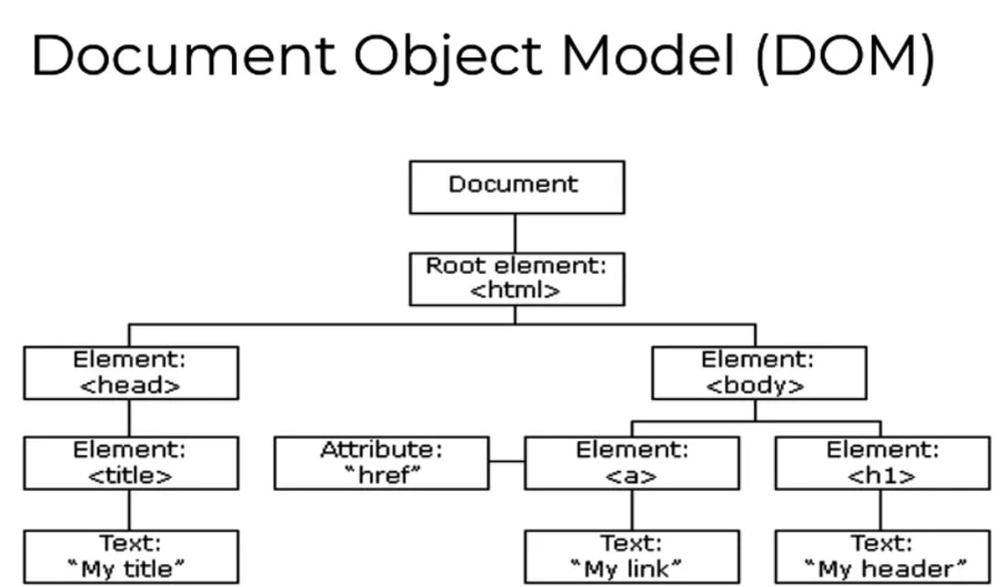
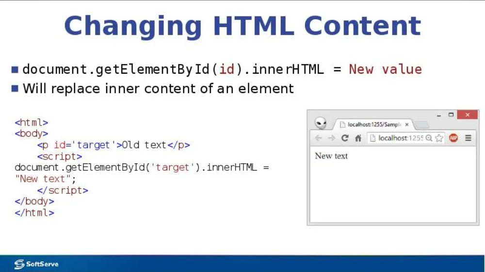

# Что такой Bom вJavaScripte
## Объектная модель браузера (анг. Browser Object Model (BOM)) — это часть JavaScript, которая позволяет скрипту взаимодействовать с программой просмотра веб-страниц. BOM представляет объекты, через свойства и методы которых можно управлять внешним видом и поведением обозревателя. 

# Что такой Dom вJavaScripte
## DOM (Document Object Model) — это специальная древовидная структура, которая позволяет управлять HTML-разметкой из JavaScript-кода. Управление обычно состоит из добавления и удаления элементов, изменения их стилей и содержимого. Браузер создаёт DOM при загрузке страницы, складывает его в переменную document и сообщает, что DOM создан, с помощью события DOMContentLoaded. 

# Что такой Dom Features
## DOM (Document Object Model) — это объектная модель документа, которая представляет структуру HTML или XML-документа в виде иерархической структуры объектов.DOM позволяет программистам изменять содержимое и стиль веб-страницы с помощью JavaScript.Некоторые наиболее часто используемые методы DOM:
* getElementById(id);
* getElementsByClassName(class);
* getElementsByTagName(tag);
* querySelector(selector);
* querySelectorAll(selector);
* createElement(tagName);
* createTextNode(text);
* appendChild(node);
* removeChild(node).

DOM-дерево состоит из объектов элементов, которые могут иметь дочерние элементы, атрибуты, стили и события.

# HTML-элемент DOM innerHTML,объект стиля
## Свойство innerHTML представляет собой содержимое элемента (элементы-потомки, комментарии, текст и т.д.), которое хранится в нём в виде строки. Свойство доступно для чтения и записи, поэтому у нас есть возможность получать и изменять содержимое элемента.

# Что такой Dom Event
## Событие — это сигнал от браузера о том, что что-то произошло.Вот список самых часто используемых DOM-событий

1) События мыши: click, contextmenu, mouseover, mouseout, mousedown, mouseup, mousemove.

2) События на элементах управления: submit, focus.

3) Клавиатурные события: keydown, keyup.

4) События документа: DOMContentLoaded.

5) CSS events: transitionend.

# Что такой Create element
## Метод createElement позволяет создать новый элемент, передав в параметре имя тега. После создания с элементом можно работать как с обычным элементом, а также его можно добавить на страницу методами prepend, append, appendChild, insertBefore или